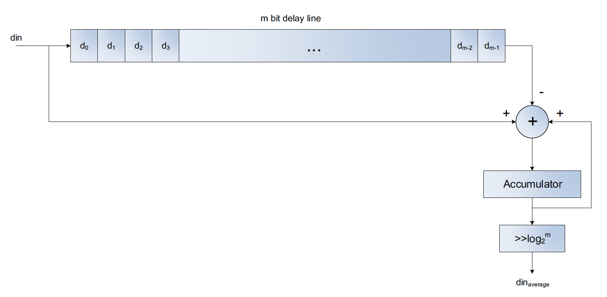

# ECE 524L Fall 2021
**California State University, Northridge**  
**Department of Electrical and Computer Engineering**  

## Lab 6 - Averager

## Objective

After completing this lab, students will be able to:
- Understand how to approach a real design problem by decomposing it to datapath and control path
- Design control unit using FSM
- Infer FPGA resources
- Synthesize a large design using structural modeling

## Requirements

The following material is required to complete the lab:
- Xilinx Vivado 2019.1

## References

- Xilinx FPGA datasheets (available at http://www.xilinx.com)
- Software Manual (available at http://www.support.xilinx.com)

## Introduction

In this lab you are going to design a programmable averager circuit that applies the averaging on a streaming data stream. Your design is supposed to accept a parameter m as the length of the averaged and calculate the average value of last ‘m’ data samples coming from the serial input data. The width of the input data ‘w’ is the second parameter that your program accepts. The block diagram of the design datapath is shown in Figure 5.1. Your program should use FPGA resources efficiently and infer them using the right FPGA coding style. You can get help from Xilinx Synthesis guide posted on the class website. Write a function that calculates the logarithm of an input and call this function in your design as it is shown in the block diagram.

Figure 5.1. Datapath capable of computing the average of 32 elements of an array stored in memory

:point_right: **Task 1:** Prove mathematically why this circuit averages ‘m’ samples of input data stream.

:point_right: **Task 2:** Use the proper coding style to infer SRL component in your design to implement the delay line. 

:point_right: **Task 3:** Use the proper coding style to infer Block RAM in your design to implement the delay line. 

:point_right: **Task 4:** Present a graph to show area usage when ‘m’ varies from 4 to 64 (in powers of 2) for task 2. 

:point_right: **Task 5:** Design a programmable random number generator of length ‘w’ bits to supply data samples to the averager circuit.

:point_right: **Task 6:** Provide testbench for your average, random number generator, logarithm function, and your overall design to prove the correct functionality.
